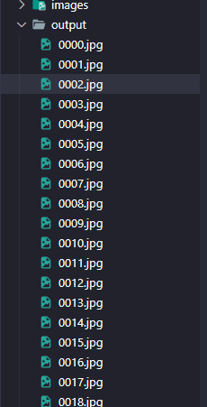

# Github Readme

### @Author : Bilge Kaan Gürgen

## Başlamadan Önce

---

- Verilen Github reposunu inceledim.
- **640x640** pixel boyutunda **Test, Train, Val** olmak üzere **3 adet video** dosyası olduğunu
- Ve **COCO** formatında Label işlemi yapıldığını okudum.
- **Bolt ,Nut** olarak 2 Class tespiti ve bunların sayılması istenmektedir.


Örnek verilmiş Bounding Box ile Object Detection yapılmış projenin aslında bizden istenen görüntüsü

**JSON formatında verilen örnek annotation dosyası**

---

```json
{
    "info": {
        "description": "Nuts and Bolts Dataset",
        "url": "",
        "version": "1.0",
        "year": 2023,
        "contributor": "Dogukan",
        "date_created": "2023/01/18"
    },
    "licenses": [],
    "images": [
        {
            "file_name": "0000.jpg",
            "width": 640,
            "height": 640,
            "id": 1
        },
				.................
				{
            "file_name": "1799.jpg",
            "width": 640,
            "height": 640,
            "id": 1800
        }
    ]
```

# 1-Preprocess

---
BU Klasörde 

- Bize Verilen videolardan örneğin 60 Saniyelik 30FPS Video’nun 1800 Frame vereceğini hesapladım. Sonucunda JSON Annotation dosyasında da o kadar id olması gerekiyor.
- Elimdeki video dan Json dosyasında görünen her Frame’in çıkması gerektedir.. Bunun için Video’yu FPS değeri kadar karelere bölerek çıkartan Python Kodu yazdım. `(Extractor.py)`
- Yazdığım `Extractor.py`  videodaki frame sayısı kadar resim üretmektedir.



> Kod sonucunda output dosyaları 1,2,3,4… .jpg olarak sıra ile gidiyordu bunun istemiyordum. Bunların düzenli olmasını istedim (0001.jpg , 0120.jpg) gibi.  `%04d` kullanarak 4 haneli atama yapılabilmiştir.
> 

# 2- Train

---

[https://github.com/wongkinyiu/yolov7](https://github.com/wongkinyiu/yolov7)


- Bu Görsel Sonucunda yolov7 kullanma kararı aldım.
- Yolov7 için gerekli formatlar ne? Hangi istekleri var bunları araştırdım.
- Ve sonucunda COCO’dan Yolo formatına dönüşüm için gerekli aşamaları anlatan bir Medium yazısı keşfettim. [Coco-format-to-Yolo-format](https://medium.com/red-buffer/converting-a-custom-dataset-from-coco-format-to-yolo-format-6d98a4fd43fc)

### **COCO’dan YOLO Verisetine Dönüşüm**

---

- COCO formatı, nesne algılama modellerinde kullanılan bir veri seti formatıdır. Bu format, nesne sınıfları, nesne koordinatları ve nesne maskeleri gibi birçok veri türünü destekleyen geniş bir veri yapısı sağlar. COCO formatı, özellikle çoklu nesne algılama için kullanışlıdır.
- YOLO formatı, özellikle YOLOv3 modelinde kullanılan bir başka popüler veri seti formatıdır. Bu format, her görüntü için ayrı bir metin dosyası içinde nesne koordinatlarını ve sınıflarını içerir. Bu format, her nesne için tek bir koordinat çifti kullanarak nesne tespiti yapar. Bu sayede YOLO, gerçek zamanlı nesne tespiti için uygun hale gelir.
- COCO formatından YOLO formatına veri seti dönüştürme işlemi, COCO formatındaki nesne etiketlerinin YOLO formatında kullanılan sınıf indeksleriyle değiştirilmesini gerektirir. Daha sonra, her görüntü için ayrı bir metin dosyası oluşturulur ve her nesnenin koordinatları ve sınıfları bu dosyaya yazılır.
- Bu işlemi gerçekleştirmek için birçok araç ve kütüphane mevcuttur. Örneğin, Python dilinde yazılmış olan "coco2yolo" ve "yolov5_converter" gibi araçlar bu dönüşüm işlemini kolaylaştırmak için kullanılabilir. Bu araçlar, COCO formatındaki veri setlerini YOLO formatına dönüştürmek için tasarlanmıştır.

Yolo için elimdeki JSON Annotation dosyasının [Medium Linkindeki](https://medium.com/red-buffer/converting-a-custom-dataset-from-coco-format-to-yolo-format-6d98a4fd43fc) Yolo Label dosyası haline gelmesi gerekiyordu.


örnek label.txt

Label dosyası içeriğindeki sutün yapısının anlamı

---

```json
(class_id, x_centre,  y_centre,  width,  height)
```


Dosya formatının buna benzer olması gerekmekte.

> Medium sayfasında ki adımları takip ettim. Fakat bir yandan araştırma yaparken daha iyi ve işimizi kolaylaştıran uygulama websitesi buldum. [Roboflow](https://roboflow.com/) Burayı kullanark verilerimizi ve label’larımızı farklı formatlarda verisetlerine dönüştürebildiğimizi gördüm.
> 

[Roboflow: Give your software the power to see objects in images and video](https://roboflow.com/)

**Extractor.py** (Frame’leri çıkartmak için yazdığım Python Dosyası) ile aldığıım 1800 output ve testannotation.json file’ı [buradaki](https://roboflow.com/convert/coco-json-to-yolo-darknet-txt) Tutorial’a göre Dataset olarak siteye yükledim.

**Verisetini Yükleme ve Yolo formatında çıktı alma örneği**

---

[How To Convert COCO JSON to YOLO Darknet TXT](https://roboflow.com/convert/coco-json-to-yolo-darknet-txt)

**Verisetinin Görüntüleri**

---


Veri setinin yüklenmiş hali

**Veri Seti yüklerken**

---

- Verilerin test, train, val olarak bölünmesini
- Boyutunu
- Augment Etme
- Preprocessing işlemleri
- Public  veya private olarak paylaşabilme gibi işlemleri yapabiliyoruz.


Görüntüler üzerinde etiketleri canlı olarak görebiliyor ve düzenleyebiliyoruz.


### **Oluşturduğum Veri Seti Link’i**

---

[Sign in to Roboflow](https://app.roboflow.com/bilge-kaan-grgen-j9nkx/obj-2/2)

## B- TRAIN

---

Yolo ile veri eğitimi yapmak, nesne algılama ve sınıflandırma için oldukça etkili bir yöntemdir. Ancak eğitim sürecinde veri setinin kalitesi ve miktarı, modelin doğruluğunu ve performansını doğrudan etkiler. Bu nedenle, iyi bir veri seti hazırlama ve etiketleme süreci, Yolo ile veri eğitimi için temel bir adımdır. Verisetini istediğimiz şekilde yukarıda ki gibi hazırladıktan sonra eğitime başlayabiliriz.

Eğitim için örnek blog yazıları buldum

- [Link 1](https://blog.paperspace.com/yolov7/)
- [Link 2](https://www.analyticsvidhya.com/blog/2022/08/how-to-train-a-custom-object-detection-model-with-yolov7/)
- [Link 3](https://medium.com/augmented-startups/yolov7-training-on-custom-data-b86d23e6623)

Burada ki linklerden bilgi edindikten sonra Youtube üzerinden yapılma adımlarını takip ettim.

[Train YOLOv7 Object Detection on Custom Dataset in Google Colab | 4K](https://www.youtube.com/watch?v=kbMfgVZn05U)

**Google Colaboratory**

---

Google Colab, araştırmacılar, öğrenciler ve geliştiriciler için ücretsiz bir Jupyter notebook ortamıdır. Colab'ın avantajlarından bazıları şunlardır:

1. Ücretsizdir
2. Güçlü Donanım: Colab, Google Cloud altyapısını kullanarak kullanıcılara güçlü donanım sağlar. Kullanıcılar, GPU ve TPU gibi donanımları kullanarak hızlı ve verimli bir şekilde makine öğrenimi modellerini eğitebilirler. Tesla K4 kartlarının hesaplama gücünü kullanarak eğitimimi yaptım.
3. Paylaşım Kolaylığı: Colab, kullanıcıların kodlarını ve not defterlerini kolayca paylaşmalarına olanak tanır. Kullanıcılar, not defterlerini doğrudan GitHub'a veya Google Drive'a kaydedebilirler.
4. Kullanım Kolaylığı: Colab, kullanıcıların Python kodlarını kolayca çalıştırmalarına olanak tanır. Kullanıcılar, ayrıca Colab'daki önceden yüklenmiş kütüphaneleri ve araçları kullanabilirler.
5. Daha Az Kurulum: Colab, kullanıcıların kendi makinelerinde kurulum yapmalarını gerektirmez. Kullanıcılar, sadece bir web tarayıcısı ve internet bağlantısı ile Colab'a erişebilirler.
6. Roboflow ile kolayca verisetini Colab ortamına dahil etme.

> Local cihazımızda ki ekran kartları ile eğitim yapmak Colab, Kaggle gibi ortamlarda ki Tesla GPU’lara göre çok çok uzun sürmektedir.
> 

### Train Notebook Dosyası

---

[Google Colaboratory](https://colab.research.google.com/drive/1N1x6fRbfz6tga9kPmcIBTE8yS0EQNZ4x#scrollTo=6AGhNOSSHY4_)

Hücrelerin anlatımı

---

```python
!nvidia-smi
```

**`nvidia-smi`** (NVIDIA System Management Interface) bir komut satırı aracıdır ve NVIDIA GPU'larının sistemle ilgili bilgilerini görüntülemek için kullanılır. Bu araç, GPU bellek kullanımını, işlemci kullanımını, sıcaklığı, saat hızını, güç tüketimini ve diğer çeşitli performans ölçümlerini görüntülemeyi sağlar.

```python
!git clone https://github.com/SkalskiP/yolov7.git
%cd yolov7
!git checkout fix/problems_associated_with_the_latest_versions_of_pytorch_and_numpy
!pip install -r requirements.txt
```

Yolov7 reposu indirilir ve requirements.txt dosyasında ki kütüphaneler yüklenir.

```python
!pip install roboflow 

from roboflow import Roboflow
rf = Roboflow(api_key="x5tKxqHm8Of46UZ2y5eV")
project = rf.workspace("bilge-kaan-grgen-j9nkx").project("obj-2")
dataset = project.version(2).download("yolov7")
```

Roboflow API'sini kullanarak belirli bir Roboflow projesindeki veri kümesini indiriyor.

```python
%cd /content/yolov7
!wget https://github.com/WongKinYiu/yolov7/releases/download/v0.1/yolov7_training.pt
```

Yolov7 modelinin eğitiminde kullanılabilecek önceden eğitilmiş bir ağırlık dosyasını indirir.

```python
%cd /content/yolov7
!python train.py --batch 16 --epochs 55 --data {dataset.location}/data.yaml --weights 'yolov7_training.pt' --device 0
```

Bu kod, YOLOv7 modeli için eğitim yapmak üzere **`train.py`** dosyasını çalıştırır.

- **`-batch 16`** parametresi, her bir eğitim adımında kullanılacak olan görüntü sayısını belirtir.
- **`-epochs 55`** parametresi, toplamda kaç epoch (bir epoch, tüm eğitim verilerinin bir kez geçtiği durumu ifade eder) eğitim yapılacağını belirtir.
- **`-data {dataset.location}/data.yaml`** parametresi, veri setinin konumunu belirten YAML dosyasının konumunu belirtir.
- **`-weights 'yolov7_training.pt'`** parametresi, önceden eğitilmiş ağırlıkların konumunu belirtir.
- **`-device 0`** parametresi, kullanılacak olan GPU numarasını belirtir.

Train komutunu çalıştırırken bazen `RuntimeError: indices should be either on cpu or on the same device as the indexed tensor (cpu)` belirtilen runtime hatası alabiliyoruz. Bunun için çok güzel ve kolay bir çözüm yolu stackoverflow’da anlatılmış. 

[Indices should be either on cpu or on the same device as the indexed tensor](https://stackoverflow.com/questions/74372636/indices-should-be-either-on-cpu-or-on-the-same-device-as-the-indexed-tensor)

Eğitim aşamasına ait görüntü.

```python
.............
.............
Epoch   gpu_mem       box       obj       cls     total    labels  img_size
     53/54     12.7G   0.03008  0.004752   0.00143   0.03626        17       640: 100% 71/71 [01:03<00:00,  1.11it/s]
               Class      Images      Labels           P           R      mAP@.5  mAP@.5:.95: 100% 9/9 [00:05<00:00,  1.56it/s]
                 all         279         698       0.966       0.937       0.988       0.818

     Epoch   gpu_mem       box       obj       cls     total    labels  img_size
     54/54     12.7G   0.01908  0.004578 0.0009224   0.02458        27       640: 100% 71/71 [01:03<00:00,  1.11it/s]
               Class      Images      Labels           P           R      mAP@.5  mAP@.5:.95: 100% 9/9 [00:07<00:00,  1.25it/s]
                 all         279         698       0.969       0.979       0.987       0.831
                bolt         279         570       0.984       0.965       0.992       0.863
                 nut         279         128       0.955       0.992       0.982         0.8
55 epochs completed in 1.108 hours.

Optimizer stripped from runs/train/exp/weights/last.pt, 74.8MB
Optimizer stripped from runs/train/exp/weights/best.pt, 74.8MB
```

```python
%load_ext tensorboard
%tensorboard --logdir /content/yolov7/runs/train
```

**`load_ext`**Tensorboard'u Colab'da kullanmamıza olanak sağlar. 

train klasörü altındaki log dosyalarına erişmek için **`logdir`** parametresi kullanılmıştır. Bu sayede, modelin eğitimi sırasında kaydedilen metrikleri ve görselleştirmeleri gözlemleyebiliriz.


```python
from google.colab import drive
drive.mount('/content/drive')
```

Google drive bağlantımızı yapıyoruz.

```python
!python [detect.py](http://detect.py/) --weights /content/yolov7/runs/train/exp/weights/best.pt --conf 0.75 --img-size 640 --source test.mp4 --view-img --nosave --no-trace
```

Eğitim sonrası Modeli kullanarak Tespit etme işlem dosyasını `detect.py` çalıştırır.

- **`-weights`**: Kullanılacak önceden eğitilmiş ağırlık dosyasının yolu.
- **`-conf`**: En az olasılık eşiği. Bu değer, algılanan bir nesnenin tahmini doğruluğunu ayarlar.
- **`-img-size`**: Girdi görüntü boyutu.
- **`-source`**: Tespit edilecek video dosyasının yolu.
- **`-view-img`**: Tespit edilen nesneleri görüntülemek için kullanılır.
- **`-nosave`**: Tespit edilen nesnelerin kaydedilmesini önlemek için kullanılır.
- **`-no-trace`**: Tespit edilen nesnelerin takip edilmesini önlemek için kullanılır.

Tespit etme aşamasında Frame’lerin hücre çıktısındaki hali.

```python
video 1/1 (225/1800) /content/yolov7/test.mp4: 3 bolts, Done. (16.5ms) Inference, (1.1ms) NMS
video 1/1 (226/1800) /content/yolov7/test.mp4: 3 bolts, Done. (27.0ms) Inference, (1.3ms) NMS
video 1/1 (227/1800) /content/yolov7/test.mp4: 3 bolts, 1 nut, Done. (17.7ms) Inference, (1.2ms) NMS
video 1/1 (228/1800) /content/yolov7/test.mp4: 3 bolts, 1 nut, Done. (19.4ms) Inference, (1.2ms) NMS
video 1/1 (229/1800) /content/yolov7/test.mp4: 3 bolts, 1 nut, Done. (16.0ms) Inference, (1.2ms) NMS
video 1/1 (230/1800) /content/yolov7/test.mp4: 3 bolts, 1 nut, Done. (16.1ms) Inference, (1.1ms) NMS
video 1/1 (231/1800) /content/yolov7/test.mp4: 2 bolts, 1 nut, Done. (32.7ms) Inference, (1.2ms) NMS
video 1/1 (232/1800) /content/yolov7/test.mp4: 2 bolts, 1 nut, Done. (16.6ms) Inference, (1.1ms) NMS
video 1/1 (233/1800) /content/yolov7/test.mp4: 2 bolts, 1 nut, Done. (16.3ms) Inference, (1.1ms) NMS
```

```python
import glob
from IPython.display import Image, display

i = 0
limit = 10000 
for imageName in glob.glob('/content/yolov7/runs/detect/exp/*.jpg'): 
    if i < limit:
      display(Image(filename=imageName))
      print("\n")
    i = i + 1
```

Veriseti’’nin tüm framelerinin .jpg formatında tespiti sonrası çıktılar.

**Yolov7 için bazı Hiperparametreler**

---

1. **`batch size`**: Batch size, eğitimde kullanılan örneklerin sayısını belirtir. Büyük batch size'lar daha hızlı bir eğitim sağlarken, GPU belleğinde yer kısıtlamasına neden olabilir.
2. **`learning rate`**: Öğrenme oranı, modelin ne kadar hızlı öğrendiğini belirler. Öğrenme oranı yüksekse, model daha hızlı öğrenir ancak aşırı uyum riski daha yüksektir.
3. **`number of epochs`**: Epoch, tüm veri kümesinin bir kez eğitimde kullanıldığı süredir. Daha fazla epoch, modelin daha fazla öğrenme şansı var ancak aşırı uyum riski daha yüksek olabilir.
4. **`input image size`**: YOLOv7 modeli, farklı boyutlardaki girdi görüntülerini işleyebilir. Daha yüksek boyutlu görüntüler, daha iyi bir algılama performansı sağlar, ancak daha yüksek hesaplama gücü gerektirir.
5. **`confidence threshold`**: Güven eşiği, modelin bir nesneyi algıladığına karar vermesi için gereken minimum güven seviyesidir.

**TensorBoard Çıktıları**

---

Tensorboard'daki "map" değeri, modelin ortalama hassasiyet değerini (mAP) ifade eder. Bu değer, modelin sınıflandırma doğruluğunu ölçmek için kullanılır. mAP, tüm sınıfların hassasiyet değerlerinin ortalamasıdır.

"map05:0.95" değeri, 0.5 ile 0.95 arasındaki tüm eşik değerleri için ortalama hassasiyet değerini ifade eder. Bu değer, modelin daha geniş bir aralıkta nasıl performans gösterdiğini gösterir.

Precision ve recall değerleri, modelin doğruluğunu daha ayrıntılı bir şekilde analiz etmek için kullanılan diğer ölçümlerdir. Precision, modelin doğru sınıflandırılan nesnelerin sayısının, toplam sınıflandırılan nesnelerin sayısına oranını ifade eder. Recall ise, modelin doğru sınıflandırılan nesnelerin sayısının, toplam gerçek nesne sayısına oranını ifade eder. Bu ölçümler, modelin hangi sınıfların daha iyi sınıflandırıldığını ve hangi sınıfların daha kötü performans gösterdiğini belirlemeye yardımcı olur.

**mAP_0.5**


mAP_0.5:0.95


Precision


Recall


### Model Dosyasına buradan ulaşabiliriniz.

---

[https://drive.google.com/file/d/1vjdGoTi0UGOjXEuRv3W6EqY0UJVcbay6/view?usp=sharing](https://drive.google.com/file/d/1vjdGoTi0UGOjXEuRv3W6EqY0UJVcbay6/view?usp=sharing)

## **C - Test Aşaması**

---

Model çıktılarımız aldıktan sonra bizden istenilen objelerin saydırılması, bounding box’lar içerisinde doğruluk değerleri ve hangi obje olduğunu gösteren bir uygulama olmasıdır.

### **1- Objeleri Saydırma İşlemi için dosyaların hazırlanması**

---

Bu  işlem adına örnek videolar aradım. Ve videolardakine benzer kodu kullanarak kendi kodumu elde ettim.

Github Reposundan ilgili kodu inceledim ve test ettim.

[https://github.com/haroonshakeel/yolov7-object-tracking](https://github.com/haroonshakeel/yolov7-object-tracking)

**Detect_or_track.py Dosyası Düzeltmeleri**

---

[detect_or_track.py](readme_media/detect_or_track.py)

Yolo’nun standart olarak içerisinde bulunan **detect.py** dosyasına bazı eklemeler yaparak track yapma özelliği eklenmiş.

Kod’da bazı hatalı ve eklediğim yerler bulunmakta. Ve -track yaparken hatalı sayma işlemleri ve yüzdelik tahmin sonucunu bounding box içerisine yazamama gibi hataları bulunmaktaydı. 

`if not opt.nolabel:` Bloğunu 

```python
if not opt.nolabel:
            label = str(id) + ":"+ names[cat] if identities is not None else  f'{names[cat]} {confidences[i]:.2f}'
```

Düzelterek aşağıdaki şekilde modifiye ederek ilerledim.

```python
if identities is not None:
                label = str(id) + ":"+ names[cat] + " " + str(conf * 100)[:4] + "%"
            else:
                label = names[cat] + " " + str(conf * 100)[:4] + "%"
```

 ****

`**# Get names and colors` Bloğunu renkleri random atamadığı için**

```python
# Get names and colors
    names = model.module.names if hasattr(model, 'module') else model.names
    colors = [[random.randint(0, 255) for _ in range(3)] for _ in names]
```

düzenledim ve aşağıdaki şekilde düzelttim.

```python
# Get names and colors
    names = model.module.names if hasattr(model, 'module') else model.names
    colors = [[random.randint(0, 135) for _ in range(3)] for _ in names]
```

`# draw boxes for visualization` Bu blok Objeleri saydırma işleminde iken confidence skorlarını ekrana bastırmasını engelliyordu. 

```python
# draw boxes for visualization
                    if len(tracked_dets)>0:
                        bbox_xyxy = tracked_dets[:,:4]
                        identities = tracked_dets[:, 8]
                        categories = tracked_dets[:, 4]
                        confidences = None
```

İlk düzeltmeyi yaptığım blok sonrasında burayı da Yolo’nun kendi **detect.py** dosyasını referans alarak düzelttim. 

```python
# draw boxes for visualization
                    if len(tracked_dets)>0:
                        bbox_xyxy = tracked_dets[:,:4]
                        identities = tracked_dets[:, 8]
                        categories = tracked_dets[:, 4]
                        confidences = dets_to_sort[:, 4]
```

Saydırma işlemini yapan Kod Son güncellemelerle birlikte Aşağıdaki gibi güncellendi.

---

[pred.py](readme_media/pred.py)

**Sort.py için yapılan düzeltmeler**

---

**Sort.py** da `# matplotlib.use('TkAgg')`  kısmını yorum satırı yaptık. Colabda çalışması için

[sort.py](readme_media/sort.py)

### 2- Colab ile model Test

---

Colab ile modeli test ettiğim adımları notebook dosyasında anlattım.

Notebook Dosyası

---

[https://drive.google.com/file/d/1BtbForG_GCb5M8spGb8GJssTC9nlwIwJ/view?usp=sharing](https://drive.google.com/file/d/1BtbForG_GCb5M8spGb8GJssTC9nlwIwJ/view?usp=sharing)

# D - Sonuç

---

Colab ile Test notebook dosyası sonrası projede bizden istenen çıktısı verilmiştir.

[https://drive.google.com/file/d/1BtbForG_GCb5M8spGb8GJssTC9nlwIwJ/view?usp=sharing](https://drive.google.com/file/d/1BtbForG_GCb5M8spGb8GJssTC9nlwIwJ/view?usp=sharing)

## Faydalı Link’ler

---

Colab Train Notebook

[Google Colaboratory](https://colab.research.google.com/drive/1N1x6fRbfz6tga9kPmcIBTE8yS0EQNZ4x?usp=sharing)

Proje Veriseti

[Sign in to Roboflow](https://app.roboflow.com/bilge-kaan-grgen-j9nkx/obj-2/2)

Object_tracking için gerekli dosyalar.

[https://drive.google.com/file/d/1vWEsg5wmFAy4PqPwugHecPzBAVgnpn0B/view?usp=sharing](https://drive.google.com/file/d/1vWEsg5wmFAy4PqPwugHecPzBAVgnpn0B/view?usp=sharing)

Model dosyası

[https://drive.google.com/file/d/1vjdGoTi0UGOjXEuRv3W6EqY0UJVcbay6/view?usp=sharing](https://drive.google.com/file/d/1vjdGoTi0UGOjXEuRv3W6EqY0UJVcbay6/view?usp=sharing)

Gpu ile model predict etmek için faydalı rehberler.

---

[Windows 10 üzerinde CUDA ve CuDNN Kurulumu](http://veribilimci.org/windows-10-uzerinde-cuda-ve-cudnn-kurulumu/)

Nvidia Cuda destekli GPU’lar

[NVIDIA CUDA GPUs - Compute Capability](https://developer.nvidia.com/cuda-gpus)

Colab’de Hücre içerisinde video oynatma

[Real-time YOLOv4 Object Detection on Webcam in Google Colab | Images and Video](https://www.youtube.com/watch?v=ebAykr9YZ30)

Colab’de train işlemi yaparken alınan hata ve çözümü 

[Indices should be either on cpu or on the same device as the indexed tensor](https://stackoverflow.com/questions/74372636/indices-should-be-either-on-cpu-or-on-the-same-device-as-the-indexed-tensor)

mAP

[mAP (mean Average Precision) for Object Detection](https://jonathan-hui.medium.com/map-mean-average-precision-for-object-detection-45c121a31173)

[Doğruluk (Accuracy) , Kesinlik(Precision) , Duyarlılık(Recall) ya da F1 Score ?](https://medium.com/@gulcanogundur/doğruluk-accuracy-kesinlik-precision-duyarlılık-recall-ya-da-f1-score-300c925feb38)

Colab Tricks

[10 tips for a better Google Colab experience](https://towardsdatascience.com/10-tips-for-a-better-google-colab-experience-33f8fe721b82)

Yolo Step by Step

[Step-by-step instructions for training YOLOv7 on a Custom Dataset](https://blog.paperspace.com/train-yolov7-custom-data/)

[Metric_Outputs.zip](readme_media/Metric_Outputs.zip)